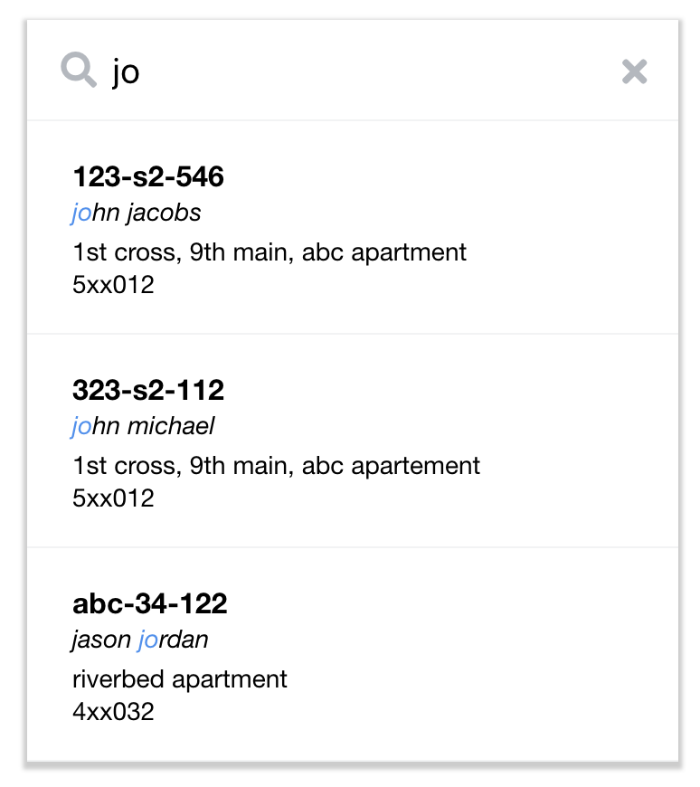
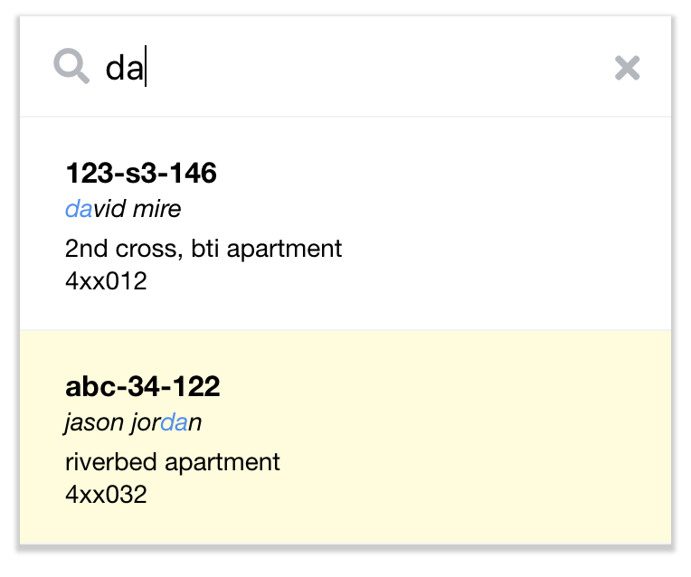
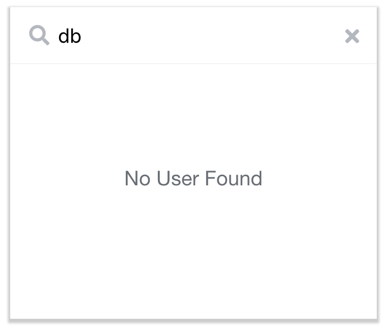

# Search Bar
An interactive search bar, which returns search result based on data previously feed. The main purpose of this app is to serve a taste like google or youtube search bar.

hosted at https://5earch-bar.netlify.com/





## Dev setup

### To set up the environment dependencies

```
$ npm install
```

### To run the portflio builder app

```
$ npm run start
```
Client app is served on port `3000`

## Deployment steps

### To build the portflio builder app

```
$ npm run build
```
Serve the `build` folder using any static server.