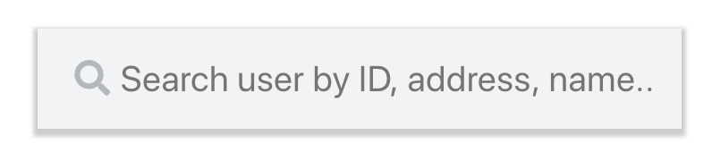

# Search Bar
An interactive search bar, which returns search result based on data previously feed. The main purpose of this app is to serve a taste like google or youtube search bar.





## Dev setup

### npm install

```
To set up the environment dependencies
```

### `npm start`

Runs the app in the development mode.<br>
Open [http://localhost:3000](http://localhost:3000) to view it in the browser.

The page will reload if you make edits.<br>
You will also see any lint errors in the console.

### `npm run build`

Builds the app for production to the `build` folder.<br>
It correctly bundles React in production mode and optimizes the build for the best performance.

The build is minified and the filenames include the hashes.<br>
Your app is ready to be deployed!